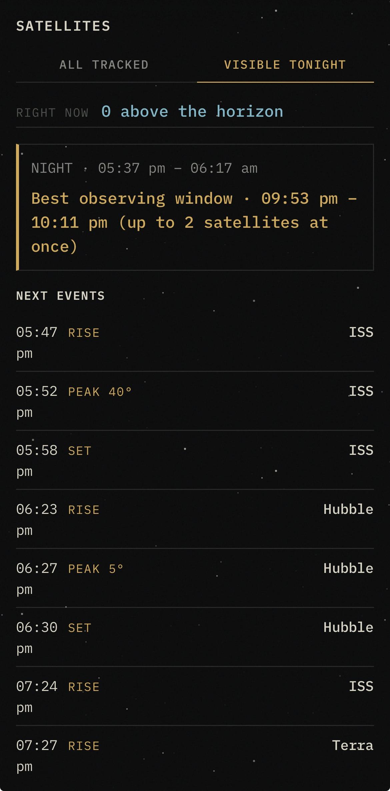
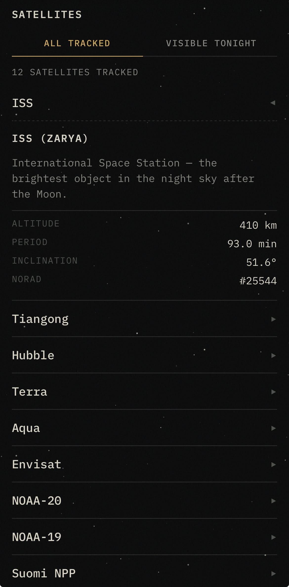
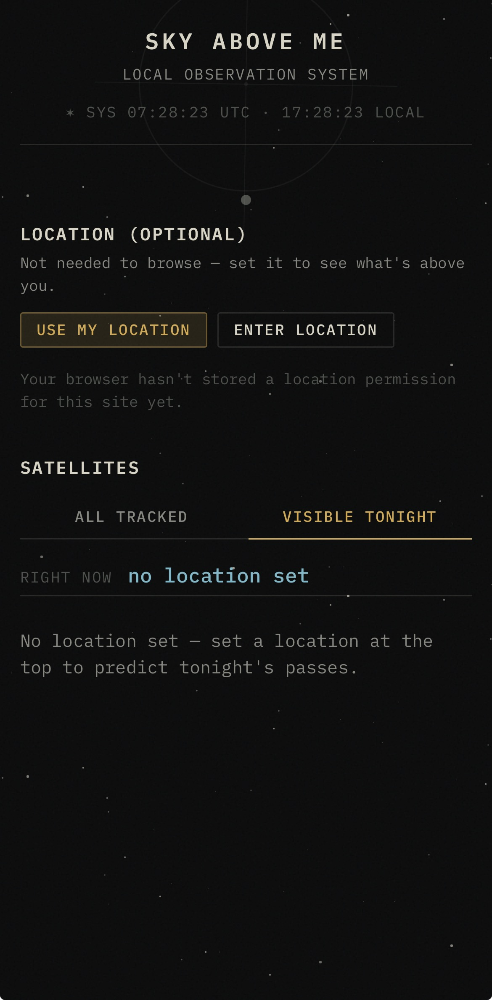
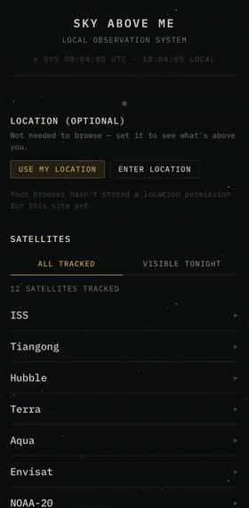

<p align="center">
  
</p>

<h1 align="center">Sky Above Me</h1>

<p align="center">
  <strong>What is happening above me right now, and what will be interesting to see soon?</strong>
</p>

<p align="center">
  <a href="https://github.com/anspiteri/SkyAboveMe"></a>
</p>


Sky Above Me is a small, mobile-first web application that combines the user's
current location and device time with public satellite orbital data, propagates
satellite positions with SGP4, and shows what is currently above the observer's
horizon as a single scrollable dashboard.

It is a personal "what's above me?" observatory that starts with Earth-orbiting
satellites. The long-term vision may grow to cover stars, planets, the Moon,
space weather, aurora, spacecraft, launches and orbital debris — but **V1 stays
small** and focused on satellites.

---

## What V1 currently does

- Builds a satellite position pipeline from browser location → SGP4 propagation
  → observer-relative position → mobile dashboard.
- Shows two satellite views behind a segmented toggle:

  - **Visible now** — only above-horizon objects, ranked by what is most
    visible / closest right now (elevation descending, then range ascending;
    a transparent, entirely data-driven sort).
  - **All tracked** — the full curated catalog to browse.

- Each satellite row is **tappable to expand a detail panel** with a curated
  description and orbit facts, plus live altitude, azimuth and range.
- **Location is fully opt-in.** It is never requested at boot. The user opts in
  via "Use my location" (GPS, fetched once on an explicit tap) or "Enter
  location" (a curated city list or raw lat/lon).
- Renders a darkness / night-sky inspired, visually polished dashboard.

---

## Demo

<div align="center">

_Insert mobile-first screenshots or recordings here. Recommended capture tips below._

<table>
  <tr>
    <td align="center" width="33%">
      <br />
      <sub><strong>Visible now</strong> — above-horizon satellites, ranked</sub>
    </td>
    <td align="center" width="33%">
      <br />
      <sub><strong>Detail panel</strong> — live az / elev / range</sub>
    </td>
    <td align="center" width="33%">
      <br />
      <sub><strong>Location</strong> — opt-in, manual or GPS</sub>
    </td>
  </tr>
</table>

_Optional: an animated capture of the live dashboard_



</div>

### Capturing assets (for you to fill in)

Drop files into `assets/screenshots/`, then replace the stub paths above. Notes:

- **Screenshots**: a PNG/JPG in a phone frame reads best for a mobile-first app.
  Target ~280–320px wide in a `<table>` row for the side-by-side layout, or a
  single centered image if you prefer.
- **Animated demo**: a short looped `.gif` (or `.webp`/`.mp4`) of the dashboard
  in action is best captured with a mobile viewport in devtools. Keep it small —
  large GIFs bloat the README.
- **Alt text** describes each image for accessibility and for anyone on a
  connection that can't load the image.

---

### Prerequisites

- [Deno](https://deno.com/) (the current stable release)

### Install

There are no npm packages to install for local development; dependencies are
pulled at runtime via Deno's import system.

```sh
# Install the JS/TS dependencies (populates node_modules for Vite tooling)
deno install
```

### Run (development)

```sh
# Full local dev: API proxy + Vite dev server
deno task dev
```

The Vite dev server runs against a local mock/dev API so you can develop without
hitting the live CelesTrak endpoint.

```sh
# Dev with a mocked satellite dataset (no network at all)
deno task dev:mock
```

### Build

```sh
deno task build
```

Output goes to `dist/`.

### Serve (production entrypoint)

```sh
deno task serve
```

This runs `main.ts`, the Deno Deploy entrypoint that serves `dist/` and hosts
the satellite data proxy.

---

## Test / check

```sh
# Unit tests (astronomy, services, utils), no external network
deno task test

# Live tests that hit the real CelesTrak endpoint (network required)
deno task test:live

# Type-check all source + API code
deno task typecheck

# Probe CelesTrak health from a single machine (used when diagnosing throttling)
deno task check:celestrak
```

---

## Privacy

Location is an **observer input, not user data**.

- The user's precise latitude/longitude stays in the browser whenever possible.
- SGP4 → topocentric math runs fully client-side.
- There are **no user accounts**, no authentication, no database, no stored
  precise location, no location history, and minimal analytics.
- A restrictive `Permissions-Policy` is set in both dev and prod:
  `geolocation=(self), camera=(), microphone=()`.
- Precise coordinates are never stored in `localStorage`, cookies, URLs, or
  error logs.

The only server piece is a serverless **proxy** for satellite data (see below).

---

## Where satellite data comes from

Primary source: **CelesTrak** (GP/OMM orbital element sets via
`celestrak.org/NORAD/elements/gp.php`).

The frontend does **not** talk to CelesTrak directly. It calls a serverless
proxy (`api/satellites.ts`, served through `main.ts`), which exists because of
concrete needs:

- **CORS**
- **caching**
- **throttling / rate limiting**
- **secret management**
- **aggregation**

The proxy is hardened to always serve data and to be respectful of CelesTrak's
usage policy:

- Fresh satellite data is fetched from CelesTrak and cached (KV + in-memory
  fallback) for **6 hours**.
- If CelesTrak is unreachable or throttling, requests **stop** (no retries on
  non-200, per policy), and a **circuit breaker** backs off for 2 hours.
- Responses follow an always-serve ladder: fresh cache → live → stale cache →
  bundled snapshot.
- Every response carries provenance via headers (`X-Satellite-Data-Source`,
  `X-Satellite-Data-Stale`), surfaced to the user as a fallback banner or a
  stale-cache notice, so it is always clear whether the data is live.

---

## Orbital calculation pipeline

```text
                                                            ┌──────────────┐
Browser location + current time                            │   Browser    │
                                            ┌──────────────│  (SGP4 math) │
                                            │              └──────────────┘
        Raw orbital elements ◄──────────────┴─── public data (proxy → CelesTrak)
                │
                ▼
          Parsed elements
                │
                ▼
          SGP4 propagation
                │
                ▼
   Position/velocity in Earth-centred frame (ECI)
                │
                ▼
          Earth-fixed (ECEF)
                │
                ▼
   Observer-relative / topocentric
                │
                ▼
   Altitude + azimuth + distance
                │
                ▼
        Presentation / dashboard
```

The pipeline is explicit about coordinate systems (ECI, ECEF, geodetic,
geocentric, topocentric) and prefers correct, well-tested transforms over
micro-optimisation. Time is handled in UTC internally; local time is a
presentation concern.

---

## Project structure

```text
├── main.ts            # Deno Deploy entrypoint: /api proxy + serves dist/
├── index.html
├── deno.json          # tasks (dev/build/test/serve), imports, Deploy config
├── vite.config.ts
│
├── public/
│   ├── favicon.svg
│   └── apple-touch-icon.png
│
├── api/
│   ├── cache.ts            # KV + in-memory cache helper
│   └── satellites.ts      # hardened satellite proxy (breaker, fallback)
│
├── src/
│   ├── main.ts
│   ├── app/                # app shell + state
│   ├── domain/             # pure data structures (satellite, observer, …)
│   ├── services/           # external I/O, propagation, data fetching
│   ├── astronomy/          # coordinate / orbital math (pure functions)
│   ├── components/         # presentation only
│   ├── data/               # curated catalog + bundled snapshot fallback
│   ├── utils/              # generic math / time helpers
│   ├── types/
│   └── styles/             # reset, tokens, global CSS
│
├── scripts/               # local dev/mock API servers + fixtures + probes
├── tools/                 # Vite-only shim for satellite.js
├── tests/                 # unit tests (astronomy, services, utils)
└── public/ …
```

---

## Architecture decisions

- **No frontend framework.** TypeScript + DOM + CSS keeps V1 lightweight and
  easy to understand.
- **Separation of concerns.** Pure domain/astronomy code has no DOM or network
  dependencies and is independently testable. Components only transform state
  into UI.
- **Honest data.** The proxy never fabricates data and always tells the user
  when the data isn't live. Visual magnitudes are not invented.
- **"Don't just tell the user where things are — tell them what is
  interesting."** There is no fabricated "interestingness" score; ranking is
  purely data-driven, and the curated detail panels carry the "why it's
  interesting."

---

## License

GNU Affero General Public License v3 (AGPL-3.0). See [LICENSE](./LICENSE).

### Intent

This is a self-hosted tool, not a library or framework. It is released under
AGPL-3.0 deliberately, and the intent is worth stating plainly:

- **Why open source at all.** It lives in my portfolio, and I treat it as real
  free software. Anyone is welcome to read the code, learn from it, or open an
  issue.
- **Why AGPL rather than a permissive license (MIT/Apache).** Because it is a
  network server, AGPL's network clause is the enforcement I actually want: if
  someone modifies this and serves it to users over a network, their changes
  must be released under the same terms. This is a deliberate guard against a
  copy being quietly forked, hosted, and claimed or monetised in a closed,
  proprietary way.
- **What it does not do.** AGPL does not stop someone from forking and running
  a public copy — it only requires the modified source to stay open. If that
  ever no longer fits, the license would need to change before contributions
  are accepted.

In short: share alike, stay transparent, and no one gets to close a derivative
off from the network.
